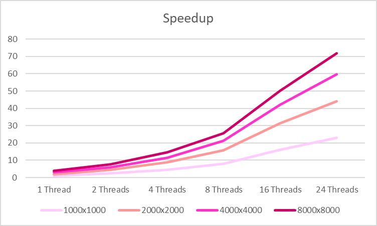
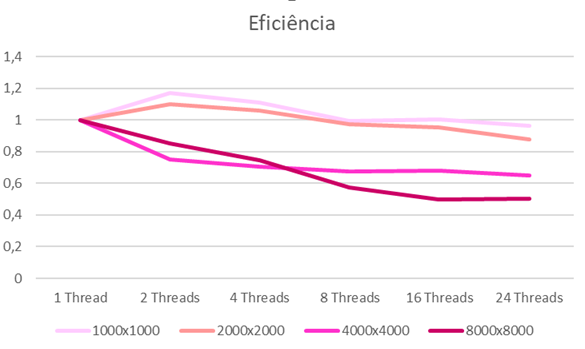

# Multiplicação de Matrizes - OpenMP

>Colaboradoras: Ellen Bonafin ([GitHub Profile](https://github.com/EllenBonafin)) e Heloisa Alves ([Github Profile](https://github.com/Helogizzy))

## Descrição do Problema
Apresentar uma análise de desempenho de um algoritmo paralelizado de multiplicação de matrizes. Utilizamos a linguagem C, que tem como suporte a biblioteca OpenMP para o modelo de programação paralela de memória compartilhada. 

## Ambiente de execução

Foi utilizado o supercomputador Santos Dumont (SDumont) por meio de uma VPN (rede privada virtual) para a execução do algoritmo. O SDumont está localizado na sede do Laboratório Nacional de Computação Científica (LNCC), em Petrópolis – RJ. 

Possui uma configuração híbrida de nós computacionais que são interligados por uma rede de interconexão Infiniband proporcionando alto rendimento e baixa latência tanto para comunicação entre os processos quanto para o acesso ao sistema de arquivos (SINAPAD, 2014).

## Detalhes da paralelização
Para a realização dos testes utilizamos a versão 9.3 do gcc (compilador C) e adotamos a multiplicações de matrizes das seguintes dimensões: 1000x1000, 2000x2000, 4000x4000 e 8000x8000. A fim de avaliar o impacto no tempo de processamento do algoritmo paralelo, cada umas das dimensões receberam testes de 1, 2, 4, 8, 16 e 24 threads. 

Os resultados são apresentados em segundos por meio da função omp_get_wtime.

## Análise de desempenho
Ao observar os resultados do speedup, notamos que as matrizes com dimensões de 8000x8000 e 4000x4000 se saíram melhor, com ênfase na de 8000x8000 que teve um speedup bem siginificativo a partir do uso de 8 threads como demonstra o gráfico de speedup.

Agora, analisando os resultados da eficiência temos o mesmo resultado, matrizes de dimensões 4000x4000 e 8000x8000 se sobresaíram novamente. Porém, em destaque para a matriz de 8000x8000 utilizando 16 e 24 threads observado no gráfico de eficiência.

## Conclusões
> #### Uma análise mais profunda pode ser observada através do documento que se encontra nesse repositório.

Nosso estudo aponta que a aplicação não é escalável pois não tem a capacidade de manter a eficiência conforme o número de processos aumenta, indo contra as leis de escalabilidade de Amdahl e Gustafson.

## Referências

BRASIL. Ministério da ciência, tecnologia e inovações. Projeto Sistema de Computação Petaflópica do SINAPAD. Configuração do SDumont. Laboratório Nacional de Computação Científica, 2014. Disponível em: < https://sdumont.lncc.br/machine.php?pg=machine >. Acesso em: 29/07/2022.

IBM. XL Fortran for AIX 15.1.0. 2021. Omp_get_wtime(). Disponível em: < https://www.ibm.com/docs/en/xl-fortran-aix/15.1.0?topic=openmp-omp-get-wtime>. Acesso em: 31/07/2022.
